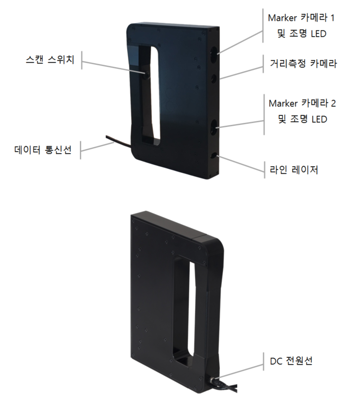
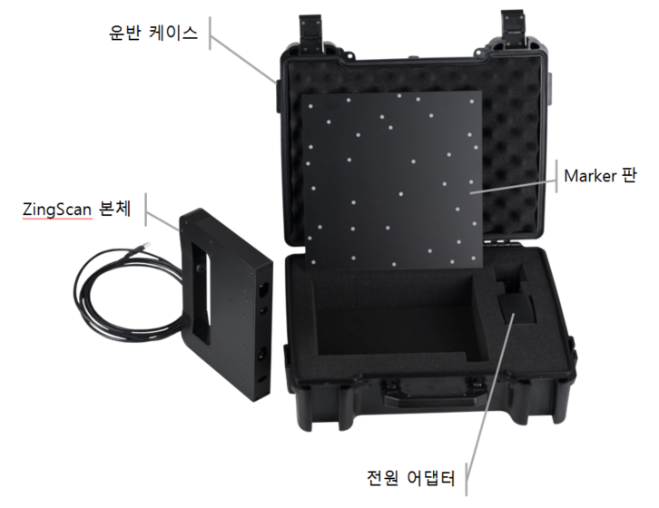

# ZingScan™ 핸드헬드 3D 스캐너 (Model: HH1604)

### 외형

### 제품 구성

### 주요 사양
Type | Description |
------|------|
**크기(D x W x H)** | 185 x 45 x 270 mm |
**무게** | 850g |
**측정 거리** | 30 ~ 60 cm | 
**측정 폭** | 수평 방향: 60°, 수직 방향: 45° | 
**측정 속도** | 30 lines / sec | 
**정확도** | 0.2 mm 이내 |
**코드 길이** | 280 cm |
**통신 방식** | USB 3.0 |
**제공 소프트웨어** | ZingScanVu™, NanoScan™ |
**출력 형식** | STL, OBJ, PLY, XYZ 등 | 
**컴퓨터 사양** | 운영체제: Windows 7 / 8 / 10 (64-bit)   CPU: 2GHZ 이상 | 

