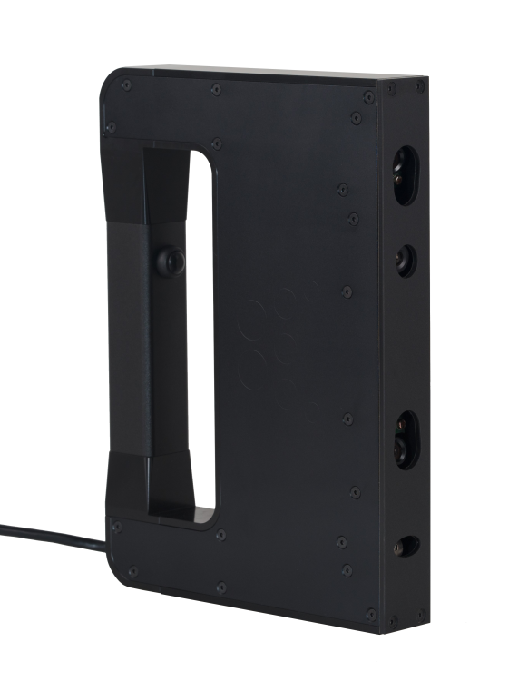

#ZingScan™ 핸드헬드 3D 스캐너 (Model: HH1604)

### 주요 특징
* 정밀도: 정확도 0.2 mm 이하
* 핸드헬드 방식 스캐너로 별도의 고정장치가 필요 없음
* 대상 물체의 크기에 제약이 없음
* 편의성: 스캐너의 버튼으로 스캐닝 시작과 종료를 할 수 있으며, 스캔 결과는 실시간으로 컴퓨터 화면으로 확인할 수 있음
* 스캔속도: 일반적인 측정 대상 물체에 대해 5분 이내에 스캐닝이 완료됨
